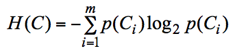
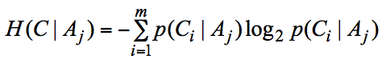
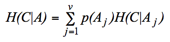
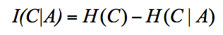

DecisionTree
============

This is a work in progress study project related to the University of Tampere course '[Knowledge Discovery](http://www.uta.fi/sis/tie/timu/timu_eng.html)'.
The aim of this project is for me to learn how to generate decision trees from training data in Python. This is not intended as an actual library for use in any real-world purpose.

# Input

The program takes as input a list of case data. Each list item can represent multiple
training cases that all have the same attributes. 

	S = [
	{'Hearing loss':'No', 'Injury':'No', 'Frequency of vertigo attacks':'0', 'classes' : {'not-BPV':3, 'BPV':0}},
	{'Hearing loss':'No', 'Injury':'No', 'Frequency of vertigo attacks':'1', 'classes' : {'not-BPV':59, 'BPV':0}},
	{'Hearing loss':'No', 'Injury':'No', 'Frequency of vertigo attacks':'2', 'classes' : {'not-BPV':1, 'BPV':55}},
	{'Hearing loss':'No', 'Injury':'Yes', 'Frequency of vertigo attacks':'2', 'classes' : {'not-BPV':21, 'BPV':1}},
	{'Hearing loss':'Yes', 'Injury':'No', 'Frequency of vertigo attacks':'0', 'classes' : {'not-BPV':63, 'BPV':0}},
	{'Hearing loss':'Yes', 'Injury':'No', 'Frequency of vertigo attacks':'1', 'classes' : {'not-BPV':28, 'BPV':0}},
	{'Hearing loss':'Yes', 'Injury':'No', 'Frequency of vertigo attacks':'2', 'classes' : {'not-BPV':234, 'BPV':0}},
	{'Hearing loss':'Yes', 'Injury':'Yes', 'Frequency of vertigo attacks':'1', 'classes' : {'not-BPV':1, 'BPV':0}},
	{'Hearing loss':'Yes', 'Injury':'Yes', 'Frequency of vertigo attacks':'2', 'classes' : {'not-BPV':30, 'BPV':0}}
	]

The above is an example of possible input. For instance the first item in the list means that there are three training cases classified as 'not-BPM', all having the attributes 'Hearing loss' = 'No', 'Injury' = 'No' and 'Frequency of vertigo attacks' = 0.

# Output

The program produces an ASCII art visualization that shows the resulting tree, which might look similar to the example below. Text art was used instead of a PNG image so that the program would have no dependencies to image libraries.

	     hearing loss
	   _______|_______
      |              |
     yes             no
      |              |
    not-BPV        injury
	             ____|____
	            |         |
	           yes       no
                |         |
               BPV     not-BPV

# What the program does

## Equations

To understand what is going on here, I recommend watching [this video](https://www.youtube.com/watch?v=-dCtJjlEEgM). The key decision to make is which attribute to split the data on. Some attributes will provide more information than others. 

To decide which attribute to branch on, some calculations are made based on equations given in the Knowledge Discovery course material. Here are all the equations and their corresponding functions in Python. The code for each function could be much shorter, but includes some printouts that make the code a bit longer but easier to follow while running.

The entropy function "H(S)" in the python code implements the equation

The function "H_given_Aj(S, A, Aj)" implements

The function "H_for_attribute(S, A)" implements

The function "I(S, A)" implements

